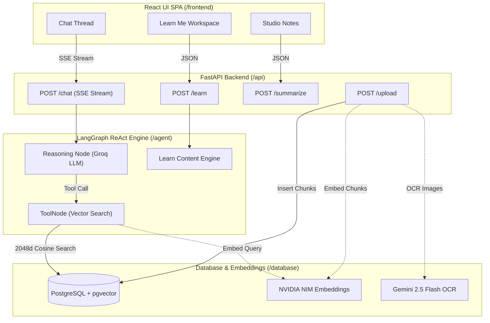

# Agentic- TutorAI  — AI Learning & Research Workspace

A production-grade, tri-API **Agentic Retrieval-Augmented Generation (RAG)** platform and **AI Learning Workspace**.

Built with **LangGraph** (ReAct agent framework), **Groq** (`openai/gpt-oss-120b` for ultra-fast reasoning & tool calling), **NVIDIA NIM** (`nvidia/nemotron-3-embed-1b` for 2048-dimensional embeddings), **Google Gemini** (`gemini-2.5-flash` for multimodal OCR), **PostgreSQL + pgvector** for semantic vector search, **FastAPI** for SSE streaming, and a **React + Vite** SPA featuring interactive **Learn Me** quizzes, flashcards, studio notes, and live reasoning traces.

> **Positioning:** *"Don't just ask your documents. Learn from them."*

---

## 📑 Table of Contents

- [Key Upgrades & Tri-API Architecture](#-key-upgrades--tri-api-architecture)
- [System Architecture](#-system-architecture)
- [Core Features](#-core-features)
  - [1. Learn Me — Interactive AI Learning Workspace](#1-learn-me--interactive-ai-learning-workspace)
  - [2. Studio Notes](#2-studio-notes)
  - [3. Live Reasoning Trace & Streaming RAG](#3-live-reasoning-trace--streaming-rag)
  - [4. Multimodal Document Processing](#4-multimodal-document-processing)
- [Tech Stack](#-tech-stack)
- [Quickstart (Docker Compose)](#-quickstart-docker-compose)
- [Environment Configuration](#-environment-configuration)
- [Local Development](#-local-development)
- [API Reference](#-api-reference)
- [Project Structure](#-project-structure)
- [License](#-license)

---

## ⚡ Key Upgrades & Tri-API Architecture

| API Provider | Model | Responsibility |
| :--- | :--- | :--- |
| **Groq API** | `openai/gpt-oss-120b` | High-speed LLM reasoning, native tool calling, quiz/flashcard/lesson generation |
| **NVIDIA NIM** | `nvidia/nemotron-3-embed-1b` | 2048-dimensional high-precision vector embeddings for semantic search |
| **Google Gemini** | `gemini-2.5-flash` | Multimodal OCR extraction for PDF, PNG, JPG, WebP images & scanned documents |

---

## 📊 System Architecture



---

## 🚀 Core Features

### 1. Learn Me — Interactive AI Learning Workspace
Transform your knowledge base from a passive document store into an adaptive **AI Tutor**:
- **Interactive Quiz Mode**: 
  - Multiple choice Q&A (5–10 items) generated strictly from uploaded context.
  - Animated feedback: **green glow** on correct choices, **red shake** animation on incorrect choices.
  - Detailed explanation & grounded source document citations (`document name`, `page number`).
  - Score summary, percentage score, and **Knowledge Gap / Weak Area detection**.
- **Card-Flip Flashcard Mode**:
  - Interactive 3D flip card (`transform: rotateY(180deg)`).
  - Front: concept prompt; Back: concise summary + citation.
  - Self-assessment tracking: **Know It** vs **Review It**.
- **Deep Grounded Lesson Mode**:
  - Comprehensive topic breakdown with Overview, Markdown sections, Key Takeaways, and Misconception warnings.
- **Adaptive Student Knowledge Profile**:
  - Tracks mastery percentage, strong concepts, and high/medium severity knowledge gaps.

### 2. Studio Notes
- **AI Transcript Synthesis**: Distills chat sessions into organized Markdown revision notes.
- **Interactive Scratchpad**: Markdown editor for writing notes and pasting research thoughts.
- **Pinned Chat Insights**: One-click pinning of valuable Q&A turns into your persistent notebook.
- **Export**: One-click `.md` download.

### 3. Live Reasoning Trace & Streaming RAG
- Real-time Server-Sent Events (SSE) stream the agent's thought process.
- Displays retrieved passage cards with similarity meters.
- Interactive citation pills (`【1 · source.pdf】`) jump to original sources.

### 4. Multimodal Document Processing
- Supports `.pdf`, `.txt`, `.md`, `.docx`, `.png`, `.jpg`, `.jpeg`, `.webp`.
- Images & scanned PDFs undergo OCR via **Gemini 2.5 Flash**.
- Automated semantic chunking and embedding via **NVIDIA NIM** (2048-dim vectors).

---

## 🛠️ Tech Stack

- **Backend**: FastAPI, Python 3.11+, AsyncIO, Pydantic v2
- **Agent Orchestration**: LangGraph, LangChain
- **LLM & Embeddings**: Groq (`openai/gpt-oss-120b`), NVIDIA NIM (`nvidia/nemotron-3-embed-1b`), Google Gemini (`gemini-2.5-flash`)
- **Database**: PostgreSQL 16 with `pgvector` extension
- **Frontend**: React 18, Vite, Framer Motion, Vanilla CSS (Dark/Light Cosmic theme)
- **Containerization**: Docker, Docker Compose, Nginx

---

## ⚡ Quickstart (Docker Compose)

### 1. Clone & Set Environment Variables
Create a `.env` file in the root directory:

```env
# Tri-API Configuration
GROQ_API_KEY=gsk_your_groq_api_key_here
NVIDIA_API_KEY=nvapi-your_nvidia_api_key_here
GOOGLE_API_KEY=AIzaSy_your_google_gemini_api_key_here

# Model Selection
CHAT_MODEL=openai/gpt-oss-120b
EMBEDDING_MODEL=nvidia/nemotron-3-embed-1b
EMBEDDING_DIM=2048

# Database Configuration
POSTGRES_USER=postgres
POSTGRES_PASSWORD=postgres
POSTGRES_DB=agentic_rag
POSTGRES_HOST=db
POSTGRES_PORT=5432
```

### 2. Launch Containers
```bash
docker compose up --build -d
```

Access the Web Application at: `http://localhost:3000`  
Access the Backend API Docs at: `http://localhost:8000/docs`

---

## 🌐 API Reference

### `POST /chat`
Streams agent thought frames, retrieved sources, and response tokens over SSE.

### `POST /learn`
Generates grounded quizzes, flashcards, lessons, or assessment profiles.

```json
// Request
{
  "topic": "Gradient Descent",
  "mode": "quiz",
  "difficulty": "medium",
  "count": 5
}
```

### `POST /upload`
Uploads document files (`.pdf`, `.png`, `.txt`, `.docx`) into the pgvector database.

### `POST /summarize`
Synthesizes chat turns into revision-ready Markdown notes.

### `GET /sources` & `DELETE /sources/{name}`
Lists or removes uploaded knowledge base documents.

---

## 📂 Project Structure

```text
agentic-rag/
├── agent/                  # LangGraph ReAct Agent & Learn Generator
│   ├── graph.py            # LangGraph workflow definition
│   ├── learn.py            # Learn Me content engine (Quizzes, Flashcards, Lessons)
│   ├── summarize.py        # Studio Notes summarizer
│   └── prompts.py          # System prompts
├── api/                    # FastAPI Routes & Schemas
│   ├── routes.py           # /chat, /learn, /summarize endpoints
│   ├── upload.py           # File upload ingestion endpoint
│   └── schemas.py          # Pydantic v2 I/O models
├── core/                   # Shared Configuration & Client Factories
│   ├── config.py           # Environment settings loader
│   └── llm.py              # Groq, NVIDIA, & Gemini client factories
├── database/               # PostgreSQL + pgvector Data Layer
│   ├── repository.py       # Similarity search & document CRUD
│   ├── ingest.py           # Ingestion pipeline & Gemini OCR
│   ├── schema.py           # Database table & HNSW index initializer
│   └── session.py          # Async connection pool
├── frontend/               # React + Vite Single Page Application
│   ├── src/
│   │   ├── components/
│   │   │   ├── LearnPanel.jsx      # Interactive Learn Me Workspace
│   │   │   ├── NotesPanel.jsx      # Studio Notes Panel
│   │   │   ├── MarkdownRenderer.jsx# Markdown parser & citation pills
│   │   │   ├── AmbientField.jsx    # Cosmic theme background canvas
│   │   │   └── Message.jsx         # Live answer turn card
│   │   └── styles.css              # Custom styling & animations
│   └── nginx.conf          # Nginx reverse proxy configuration
└── docker-compose.yml      # Multi-container Orchestration
```

---

## 📜 License

MIT License. Designed for learning, research, and high-performance document synthesis.
